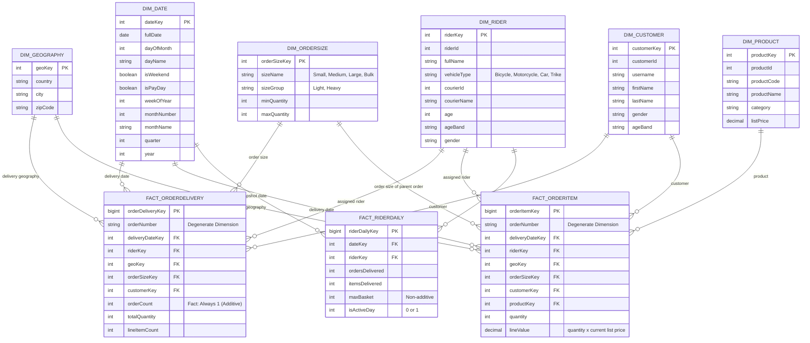

# Data Warehousing Schema

- This displays the schema used for the data warehousing (star schema with three fact tables sharing conformed dimensions)

## Fact tables

| Fact table           | Type              | Grain                                                          | Main measures                                                   | Answers questions like                                                                                                                                    |
| -------------------- | ----------------- | -------------------------------------------------------------- | --------------------------------------------------------------- | --------------------------------------------------------------------------------------------------------------------------------------------------------- |
| `FACT_ORDERDELIVERY` | Transaction       | One row per order                                              | `orderCount`, `totalQuantity`, `lineItemCount`                  | Which vehicle types carry which order sizes? How is order volume split across couriers? Is work spread evenly across riders? (Q1–3, 5–7, 9, 12–14, 20–22) |
| `FACT_ORDERITEM`     | Transaction       | One row per product in an order                                | `quantity`, `lineValue`                                         | Which product categories make up Heavy orders? Which categories travel on which vehicle types? Which products lead by units and value? (Q4, 17–19)        |
| `FACT_RIDERDAILY`    | Periodic snapshot | One row per rider per delivery date (zero-order days included) | `ordersDelivered`, `itemsDelivered`, `maxBasket`, `isActiveDay` | How utilized is each vehicle type? Which riders are idle or overloaded? How loaded is the network on its busiest days? (Q8, 10, 11, 15)                   |

Question 16 (drill-across) uses `FACT_ORDERDELIVERY` and `FACT_RIDERDAILY` together through the shared `DIM_DATE`.

## Dimension hierarchies

| Dimension       | Hierarchy                                                   |
| --------------- | ----------------------------------------------------------- |
| `DIM_DATE`      | Year > Quarter > Month > Day (alternate: Year > Week > Day) |
| `DIM_RIDER`     | Courier > Vehicle Type > Rider (alternate: Age Band > Age)  |
| `DIM_GEOGRAPHY` | Country > City > Zip Code                                   |
| `DIM_ORDERSIZE` | Size Group > Size                                           |
| `DIM_PRODUCT`   | Category > Product                                          |
| `DIM_CUSTOMER`  | Age Band > Gender                                           |

## Business questions

| #   | Theme               | Business question                                                                                   | Fact table                 | Dimensions and measures                             | OLAP op          | Insight it supports                           |
| --- | ------------------- | --------------------------------------------------------------------------------------------------- | -------------------------- | --------------------------------------------------- | ---------------- | --------------------------------------------- |
| 1   | Fleet fit           | Which vehicle types carry which order sizes?                                                        | ORDERDELIVERY              | Vehicle × Size, orders                              | Pivot, dice      | Vehicle-assignment rules                      |
| 2   | Fleet fit           | How often do Heavy orders ride bicycles, and single-item orders ride cars?                          | ORDERDELIVERY              | Vehicle × Size Group, orders                        | Slice            | Overload and underuse of vehicles             |
| 3   | Fleet fit           | What is the average order size (items) per trip by vehicle type?                                    | ORDERDELIVERY              | Vehicle, items per order                            | Roll-up          | Right-sizing the fleet                        |
| 4   | Fleet fit           | Which product categories travel on which vehicle types?                                             | ORDERITEM                  | Category × Vehicle, units                           | Dice             | Damage and capacity risk for bulky categories |
| 5   | Courier             | How is order volume split across couriers?                                                          | ORDERDELIVERY              | Courier, orders                                     | Roll-up          | Dependency risk and contract negotiation      |
| 6   | Courier             | Which vehicle types does each courier use?                                                          | ORDERDELIVERY              | Courier × Vehicle, orders                           | Drill-down       | Courier capability profile                    |
| 7   | Courier             | Do some couriers receive heavier orders?                                                            | ORDERDELIVERY              | Courier × Size Group, orders                        | Pivot            | Fair comparison between couriers              |
| 8   | Courier             | Does rider utilization differ by courier, age band, or gender?                                      | RIDERDAILY                 | Courier, Age Band, Gender, active-day share         | Slice, dice      | Staffing and courier balance                  |
| 9   | Rider workload      | Is work spread evenly across riders?                                                                | ORDERDELIVERY              | Rider, orders and items                             | Drill-down       | Dispatch load-balancing                       |
| 10  | Rider workload      | How utilized is each vehicle type, including idle days?                                             | RIDERDAILY                 | Vehicle, active-day %, orders per rider-day         | Roll-up          | Idle capacity and fleet size                  |
| 11  | Rider workload      | Which riders are idle or overloaded?                                                                | RIDERDAILY                 | Rider, active days, peak-day orders                 | Drill-down       | Rebalancing and spare capacity                |
| 12  | Rider workload      | Does workload differ by rider age band or gender?                                                   | ORDERDELIVERY              | Age Band × Gender, orders per rider                 | Slice, dice      | Equity check on dispatching                   |
| 13  | Demand and capacity | How does volume move month to month, and what is the growth?                                        | ORDERDELIVERY              | Year > Month, orders                                | Roll-up          | Capacity planning                             |
| 14  | Demand and capacity | How do weekdays, weekends, and paydays compare?                                                     | ORDERDELIVERY              | Day Name, weekend and payday flags, orders per day  | Slice            | Shift scheduling                              |
| 15  | Demand and capacity | How loaded is the network on its busiest days?                                                      | RIDERDAILY                 | Date, orders per active rider                       | Roll-up          | Peak staffing and order caps                  |
| 16  | Demand and capacity | Do days with larger average order sizes also bring heavier rider loads?                             | ORDERDELIVERY + RIDERDAILY | Date, average order size vs orders per active rider | Drill-across     | Whether order size adds to peak strain        |
| 17  | Product             | Which categories make up Heavy orders?                                                              | ORDERITEM                  | Category × Size Group, units                        | Pivot            | Vehicle planning by category                  |
| 18  | Product             | Which products and categories lead by units and list-price value?                                   | ORDERITEM                  | Category > Product, units, value                    | Drill-down       | Category focus                                |
| 19  | Product             | How does category demand move by month?                                                             | ORDERITEM                  | Year > Month × Category, units                      | Roll-up          | Seasonal capacity by category                 |
| 20  | Geography           | Where is demand concentrated? _(conditional)_                                                       | ORDERDELIVERY              | Country > City > Zip, orders                        | Drill-down       | Where to position fleet                       |
| 21  | Geography           | Which zones or countries have the most Heavy orders, and which vehicles serve them? _(conditional)_ | ORDERDELIVERY              | Country > Zip × Size Group × Vehicle                | Dice             | Heavier vehicles to heavier zones             |
| 22  | Customer            | How concentrated are orders across customers, and do age bands buy different order sizes?           | ORDERDELIVERY              | Customer, Customer Age Band × Size                  | Drill-down, dice | Customer targeting                            |

## Reports

| Report                                 | Questions      | Fact tables                     | Decision it supports                             |
| -------------------------------------- | -------------- | ------------------------------- | ------------------------------------------------ |
| **R1 Fleet Fit**                       | 1, 2, 3, 4     | ORDERDELIVERY, ORDERITEM        | Vehicle-assignment rules by order size           |
| **R2 Courier Mix**                     | 5, 6, 7, 8     | ORDERDELIVERY, RIDERDAILY       | Courier dependency and contract terms            |
| **R3 Rider Workload and Utilization**  | 9, 10, 11, 12  | ORDERDELIVERY, RIDERDAILY       | Dispatch balancing and idle capacity             |
| **R4 Demand and Capacity Calendar**    | 13, 14, 15, 16 | All three (drill-across for 16) | Capacity planning and peak staffing              |
| **R5 Product and Order Composition**   | 17, 18, 19     | ORDERITEM                       | What fills heavy orders, category planning       |
| **R6 Geographic and Customer View**    | 20, 21, 22     | ORDERDELIVERY                   | Positioning heavier vehicles, customer targeting |
| **R0 Data Quality and Reconciliation** | none           | All                             | Row counts, Unknown-member counts, rejected rows |

## Notes and Limitations

### Question Feasibility

The business questions represent candidate analyses supported by the dimensional model. Their feasibility depends on the availability and quality of the source data. Each question is validated through data profiling before analysis. Questions are marked as **Not Supported** when the data cannot produce valid results, such as when a field is too sparse, nearly unique, or constant.

### Interpretation of Results

The source dataset exhibits characteristics of synthetic data generation, with several approximately uniform distributions. Flat distributions are treated as valid findings and reported accordingly. All insights are based exclusively on measured query results.

### Scope Limitations

The source dataset does not contain a reliable order-creation timestamp because all `createdAt` values share the same bulk-load timestamp. Consequently, analyses involving delivery speed, SLA compliance, and hour-of-day patterns are excluded.

### Indicative Basket Value

The `lineValue` field is calculated using the current list price because the `OrderItems` table does not contain a historical item price. Therefore, the resulting values represent **indicative basket value**, not actual revenue.
