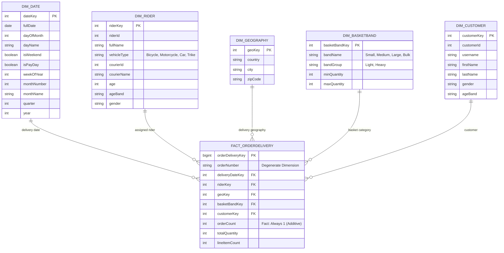

# Data Warehousing Schema

- This displays the schema used for the data warehousing

```mermaid
erDiagram
    FACT_ORDERDELIVERY {
        bigint orderDeliveryKey PK
        string orderNumber "Degenerate Dimension"
        int deliveryDateKey FK
        int riderKey FK
        int geoKey FK
        int basketBandKey FK
        int customerKey FK
        int orderCount "Fact: Always 1 (Additive)"
        int totalQuantity
        int lineItemCount
    }

    DIM_DATE {
        int dateKey PK
        date fullDate
        int dayOfMonth
        string dayName
        boolean isWeekend
        boolean isPayDay
        int weekOfYear
        int monthNumber
        string monthName
        int quarter
        int year
    }

    DIM_RIDER {
        int riderKey PK
        int riderId
        string fullName
        string vehicleType "Bicycle, Motorcycle, Car, Trike"
        int courierId
        string courierName
        int age
        string ageBand
        string gender
    }

    DIM_GEOGRAPHY {
        int geoKey PK
        string country
        string city
        string zipCode
    }

    DIM_BASKETBAND {
        int basketBandKey PK
        string bandName "Small, Medium, Large, Bulk"
        string bandGroup "Light, Heavy"
        int minQuantity
        int maxQuantity
    }

    DIM_CUSTOMER {
        int customerKey PK
        int customerId
        string username
        string firstName
        string lastName
        string gender
        string ageBand
    }

    DIM_DATE ||--o{ FACT_ORDERDELIVERY : "delivery date"
    DIM_RIDER ||--o{ FACT_ORDERDELIVERY : "assigned rider"
    DIM_GEOGRAPHY ||--o{ FACT_ORDERDELIVERY : "delivery geography"
    DIM_BASKETBAND ||--o{ FACT_ORDERDELIVERY : "basket category"
    DIM_CUSTOMER ||--o{ FACT_ORDERDELIVERY : "customer"
```
