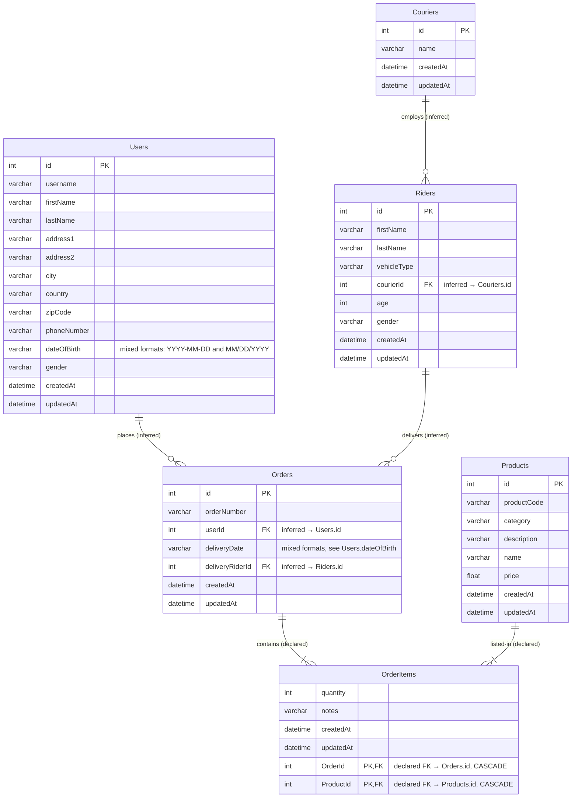

# Source Database Schema (MySQL dump → `source_db`)

Visual reference for the raw dumps in `db/raw-dumps/`. Documentation only —
the executable schema lives in `db/source/init/01_source_schema.sql`.

## Relationship inventory

| # | From → To | Via | Declared in dump? |
|---|-----------|-----|-------------------|
| 1 | Couriers → Riders | `Riders.courierId` | No — inferred |
| 2 | Users → Orders | `Orders.userId` | No — inferred |
| 3 | Riders → Orders | `Orders.deliveryRiderId` | No — inferred |
| 4 | Orders → OrderItems | `OrderItems.OrderId`, ON DELETE/UPDATE CASCADE | Yes |
| 5 | Products → OrderItems | `OrderItems.ProductId`, ON DELETE/UPDATE CASCADE | Yes |

Inferred edges will be promoted to enforced `FOREIGN KEY`s in
`01_source_schema.sql` so orphan rows fail fast at load time.

## Raw volume (measured)

| Table | Rows | Size |
|-------|------|------|
| Couriers | 3 | 4 KB |
| Riders | 100 | 12 KB |
| Users | ~100,000 | 19 MB |
| Products | ~10,000 | 1.8 MB |
| Orders | ~1,000,000 | 84 MB |
| OrderItems | ~2,000,000 | 124 MB |
